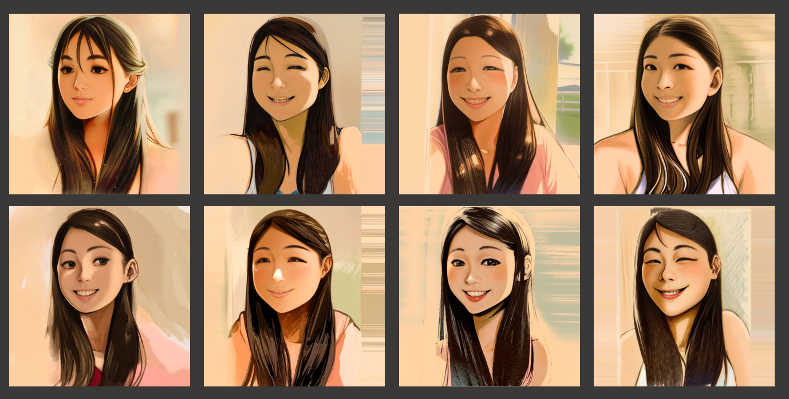
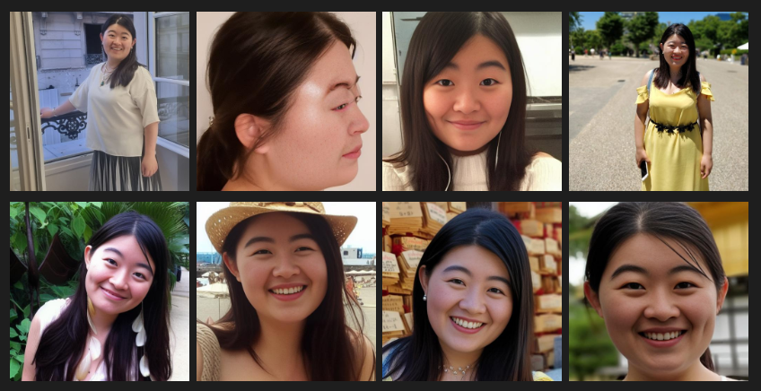
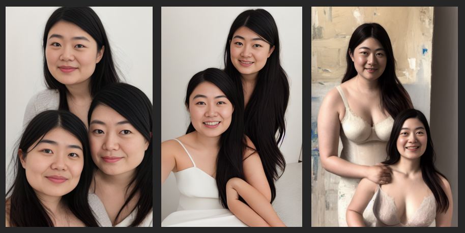
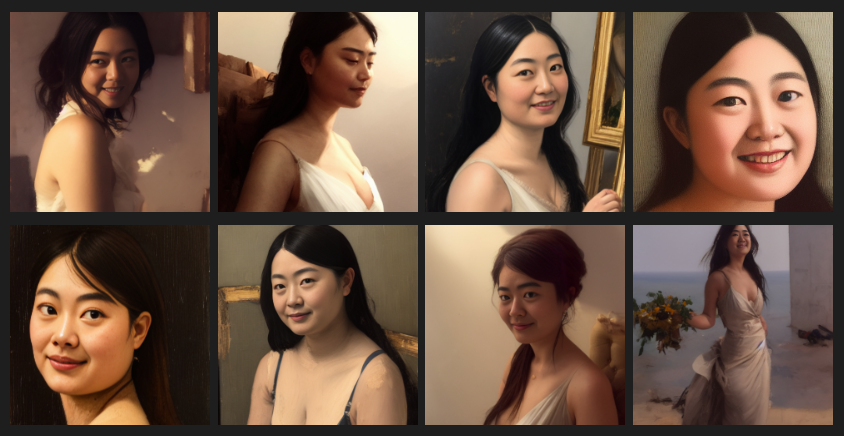

# Learning Notes on Textual Inversion for Stable Diffusion

Author: ***Timothy Wong***

Published: 24 Feburary 2023

# Training Textual Embedding

There is a very good guide on [Textual Inversion written by Benny Cheung](https://bennycheung.github.io/stable-diffusion-training-for-embeddings), please read this first. I followed the steps there and created my own embeddings. Textual embedding is primarily used to teach the Stable Diffusion model your own concept, e.g. a particular face, a specific object, a drawing style... etc. 



This note is to provide supplementary information after my own learning.

## Data Preparation

It is very important to train the embedding with good quality data. Overwhelming the training data with highly correlated images may confuse the embedding: 

- **Too many close up pictures** Embedding may confuse the trained embedding as a reference to a particular zoom level.

- **Identical background** I used a set of pictures taken at a plain white wall during my first training attempt (unsuccessful). The embedding clearly learned the colour of wall.

- **Identical clothing & hairstyle** If the training data contains images with same clothing and hairstyle, it is likely that the embedding will pick these up too.

Since our goal is to train the embedding of a face (but not the hairstyle, background... etc), it is important to include a wide variety of training data. This means we need:

- Photos taken at different environments, e.g. lighting condition
- Photos containing different facial expressions (smile, not smiling, laughing, hairstyle...)
- Full body photos as well as close up portraits

Here are some of the photos selected from the training set. They have a variety of zoom levels, background, hairstyle, clothing, etc...:



## Training Process

The first step is to create an embedding, you need to navigate to `Train > Create Embedding`. There are several arguments required at this step:

- **Name** a unique word for the concept which you are training, e.g. `realperson_v3`. This term should not be used for anything else. 
- **Initilization Text** To leave empty to start with empty vector. 
- **Number of vectors per token** determines how much information the embedding may store, since I am training a particular face, I choose to use `30` vectors per token.

Next step, go to `Preprocess images` tab. Select the source and destination directories. The dimension of the image should be `512 * 512`. Check the box for `Use BLIP for caption`, this will automatically generate caption for the images. Click on `Preprocess`.

Upon inspection of the preprocessed data, it was later found that the quality of caption may not be good enough. I have manually corrected some of the captions.

Afterwards, move to the `Train` tab. It is found better to have decreasing learning rate to speed up training of the embedding. I used `5e-2:100,5e-3:500,5e-4:1000, 5e-5:1500,5e-6` and batch size is kept at `1`. 

Noticibly, my device has relatively low-spec and I encountered out-of-memory issue during training. To mitigate this problem, the dimension of the training data is resized to `256 * 256` within the `Train` tab (the preprocessed files are still `512 * 512`). 

Once training has started, it will create images at fixed steps. As training progresses, the embedding should produce images which resemble the training data. I noticed that steps over `2000` has very little effect on the embedding.


# Generate Images using txt2img

Once the embedding is trained, the embedding file needs to be moved to the correct directory in order to be discovered by the WebUI. 

After a few attempts, I found that the effects of the embedding is too strong. For instance, invoking the embedding along creates multiple faces in the same picture. Pictures below shows early attempt in rendering the face:



To balance the effect of the embedding in the prompt, you may follow these guides on how to adjust weight:

- [Emphasise words](https://github.com/AUTOMATIC1111/stable-diffusion-webui/wiki/Features#attentionemphasis)
- [Useful Prompt Guide](https://stable-diffusion-art.com/prompt-guide/)
- [How to make textual inversion styles weaker in Automatic1111](https://www.reddit.com/r/StableDiffusion/comments/10tjux8/how_to_make_textual_inversion_styles_weaker_in/)
- [My findings using Textual Inversion for Stable Diffusion](https://www.reddit.com/r/StableDiffusion/comments/xe40ag/my_findings_using_textual_inversion_for_stable/)

After a few attempts, I managed to generate some artistic pictures using the embedding. In my case, the effect of the embedding is reduced using a prompt such as: 

```
A (((oil painting))) of [[[[[my_embedding]]]]] by (((Leonardo da Vinci))))
``` 

Here are some of the results:


